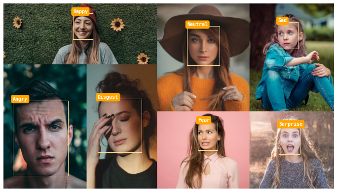
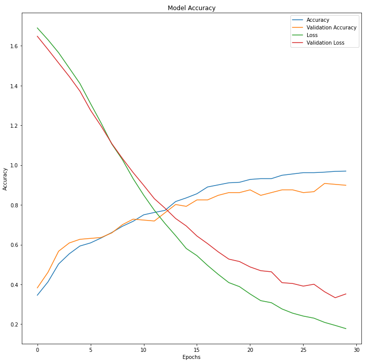

# Emotion-Detection-using-Keras
The goal of this project is to build a basic emotion detector using the __Extended Cohn Kanade Images__ Dataset by leveraging the inherent capabilities of __VGG-Face(VGG16)__ to recognize facial features.   
We use transfer learning to train our model quickly with the help of pre-trained weights available for VGG-Face in Keras.

## Motivation- ##
1) To learn different open source tools and libraries such as,
* Keras
* VGG-Face model & VGG16
* MTCNN face detection model
2) To implement various deep learning techniques such as,
* Transfer learning
* Data augmentation strategies

## Target Emotions- ##
1) Happy
2) Sad
3) Angry
4) Neutral
5) Surprise
6) Fear
7) Disgust

## Dataset- ##  
Training images = 764  
Testing images = 217  
The images have been already cropped to the person's face.

We have achieved an accuracy of 90.78% in 30 Epochs with a batch size of 4.  
This project puts a huge emphasis on the model performance on real world images instead of accuracy.  

## Observation- ##
It was observed that the model tends to perform well on emotion labels such as happy, neutral, sad & angry while it gets confused among emotion labels such as surprise, fear & disgust.    

## Future scope- ##   
Using FER2013 dataset to pre-train the network before training it on CK+ dataset to introduce a richer learning scope for the model.
